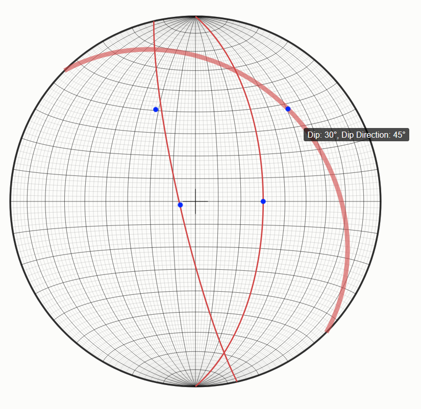

# Stereonet.js Documentation

## Overview

Stereonet.js is a minimalistic TypeScript library for creating stereonet plots using D3.js. It provides an intuitive API for plotting planes and lines on a stereonet, with built-in support for animations, tooltips, and customizable styles.



---

## Installation

Install the library via npm:

```bash
npm install stereonet
```

---

## Features

- **Plot Planes and Lines**: Add planes and lines to the stereonet with ease.
- **Customizable Styles**: Fully customizable styles for planes, lines, graticules, and more.
- **Animations**: Smooth animations for adding elements to the stereonet.
- **Tooltips**: Interactive tooltips for planes and lines.
- **Graticules**: Toggle visibility of graticules and crosshairs.
- **Responsive Design**: SVG-based rendering ensures scalability.

---

## Usage

### Importing the Library

```typescript
import { Stereonet } from "stereonet";
```

### Creating a Stereonet Instance

```typescript
const stereonet = new Stereonet({
  selector: "#container", // CSS selector for the container element
  size: 900,              // Size of the stereonet (default: 1000)
  showGraticules: true,   // Show graticules by default (default: true)
});
```

### Adding Planes

```typescript
stereonet.addPlane(30, 45); // Adds a plane with a dip angle of 30° and dip direction of 45°. Returns the ID of the added plane.
```

### Adding Lines

```typescript
const plane = stereonet.addLine(60, 90); // Adds a line with a dip angle of 60° and dip direction of 90°. Returns the ID of the added line.
```

### Removing Planes and Lines

It is best to assign the return values of `addPlane` and `addLine` to a variable, as they return the ID of the added plane or line. You can then use these IDs to remove them later.

```typescript
stereonet.removePlane(0); // Removes the plane with ID 0
stereonet.removeLine(0);  // Removes the line with ID 0
```

### Toggling Graticules

```typescript
stereonet.showGraticules();  // Show graticules
stereonet.hideGraticules();  // Hide graticules
stereonet.toggleGraticules(); // Toggle graticules visibility
```

---

## Options

The `Stereonet` constructor accepts the following options:

| Option           | Type                          | Default       | Description                                                                 |
|-------------------|-------------------------------|---------------|-----------------------------------------------------------------------------|
| `selector`        | `string`                     | `"body"`      | CSS selector for the container element.                                    |
| `size`            | `number`                     | `1000`        | Size of the stereonet (width and height in pixels).                        |
| `style`           | `Record<string, any>`        | `DEFAULT_STYLE` | Custom styles for stereonet elements (see [Styles](#styles)).             |
| `animations`      | `{ duration: number } | false` | `{ duration: 300 }` | Animation settings or `false` to disable animations.                      |
| `showGraticules`  | `boolean`                    | `true`        | Whether to show graticules by default.                                     |

---

## Methods

### `addPlane(dipAngle: number, dipDirection: number): number`

Plots a plane on the stereonet.

- **Parameters**:
  - `dipAngle`: Dip angle of the plane (0–90°).
  - `dipDirection`: Dip direction of the plane (0–360°).
- **Returns**: The ID of the added plane.

---

### `addLine(dipAngle: number, dipDirection: number): number`

Plots a line on the stereonet.

- **Parameters**:
  - `dipAngle`: Dip angle of the line (0–90°).
  - `dipDirection`: Dip direction of the line (0–360°).
- **Returns**: The ID of the added line.

---

### `removePlane(planeId: number): void`

Removes a plane from the stereonet.

- **Parameters**:
  - `planeId`: The ID of the plane to remove.

---

### `removeLine(lineId: number): void`

Removes a line from the stereonet.

- **Parameters**:
  - `lineId`: The ID of the line to remove.

---

### `getPlanes(): Array<{ id: string, path: PlanePath }>`

Returns a list of all planes currently plotted on the stereonet.

---

### `getLines(): Array<{ id: string, path: LinePath }>`

Returns a list of all lines currently plotted on the stereonet.

---

### `showGraticules(): void`

Shows the graticules on the stereonet.

---

### `hideGraticules(): void`

Hides the graticules on the stereonet.

---

### `toggleGraticules(v?: boolean): void`

Toggles the visibility of the graticules.

- **Parameters**:
  - `v`: Optional boolean to explicitly set the visibility (`true` to show, `false` to hide).

---

### `getStyle(className: string): string`

Returns the CSS style string for a given class name.

- **Parameters**:
  - `className`: The name of the style class.
- **Returns**: A string representation of the style.

---

### `setStyle(className: string, style: Record<string, any>): void`

Sets the style for a given class name.

- **Parameters**:
  - `className`: The name of the style class.
  - `style`: An object representing the new style.

---

## Styles

The `style` option allows you to customize the appearance of stereonet elements. Below are the default styles:

```typescript
const DEFAULT_STYLE = {
  outline: {
    fill: "none",
    stroke: "#000",
    "stroke-width": "4px",
    "stroke-opacity": 0.5,
  },
  graticule: {
    fill: "none",
    stroke: "#777",
    "stroke-width": "0.5px",
    "stroke-opacity": 0.5,
  },
  graticule_10_deg: {
    stroke: "#000",
    "stroke-width": "0.6px",
    fill: "none",
  },
  crosshairs: {
    stroke: "#000",
    "stroke-width": "1px",
    fill: "none",
  },
  data_plane: {
    stroke: "#d14747",
    "stroke-width": "3px",
    fill: "none",
  },
  data_line: {
    fill: "#0328fc",
    stroke: "#0328fc",
    "stroke-width": "2px",
    "stroke-opacity": 0.5,
    "fill-opacity": 1,
  },
  cardinal: {
    fill: "#000",
    "font-size": "12px",
    "text-anchor": "middle",
  },
};
```

---

## Example

```typescript
import { Stereonet } from "stereonet";

const stereonet = new Stereonet({
  selector: "#container",
  size: 900,
  showGraticules: true,
});

stereonet.addPlane(30, 45);
stereonet.addLine(60, 90);

stereonet.showGraticules();
stereonet.setStyle("data_plane", { stroke: "#00ff00", "stroke-width": "5px" });
```

---


## Development

### Publish to NPM
The library is built on Github actions. A relase is automatically published to NPM using [semantic-release](https://github.com/semantic-release/semantic-release). Deployments are triggered when pushing on `main` branch with a commit message containting `feat`, `fix`, or `perf` (see the [docs](https://semantic-release.gitbook.io/semantic-release/recipes/release-workflow/distribution-channels))


### Github Pages

To update the example on Github pages, run the following command:

```bash
npm run deploy:gh-pages
```

---

## Acknowledgements

- Vite library-mode setup bootstrapped using [kbysiec/vite-vanilla-ts-lib-starter](https://github.com/kbysiec/vite-vanilla-ts-lib-starter/).
- Based on [this article](https://medium.com/@rickgao/d3-schmidt-net-visualization-6779a7b81d2b) by Rick Gao. Respective CodePen [here](https://codepen.io/rickgao/pen/BQYwoa).